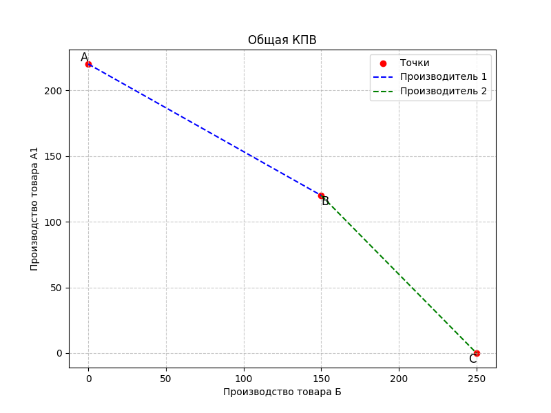

# Телеграм-бот для решения экономических задач

Этот проект представляет собой телеграм-бота, который позволяет пользователям производить анализ экономических сценариев. Бот включает в себя следующие функциональности:

## 1. Построение общей Кривой Производственных Возможностей (КПВ)

Пользователи могут вводить максимальные объемы производства товаров для двух производителей. Бот строит график КПВ на основе введенных данных, показывая точки A, B и C.



## 2. Нахождение точки рыночного равновесия

Пользователи могут вводить коэффициенты спроса и предложения. Бот рассчитывает и визуализирует точку рыночного равновесия на графике.

## 3. Расчет объема дефицита/излишка

Пользователи вводят коэффициенты спроса и предложения, а также уровень цены. Бот рассчитывает и сообщает объем дефицита/излишка на рынке.

## 4. Расчет прибыли фирмы

Пользователи вводят данные, такие как объем производства, цена за единицу товара и издержки. Бот рассчитывает прибыль фирмы и выводит результат.

## Использование

1. Запустите бота, используя скрипт `bot.py`. (Внимание: Замените `'BOTS_TOKEN'` на реальный токен вашего Telegram-бота.)
2. В Telegram выберите опцию и следуйте инструкциям бота для ввода необходимых данных.
3. Получайте результаты анализа в виде графиков и расчетов.

## Зависимости

Проект написан на языке Python 3 с использованием библиотек:

- `telebot` - для взаимодействия с API Telegram.
- `matplotlib` - для построения графиков.

## Установка зависимостей

Для установки необходимых библиотек выполните:

```bash
pip install -r requirements.txt


